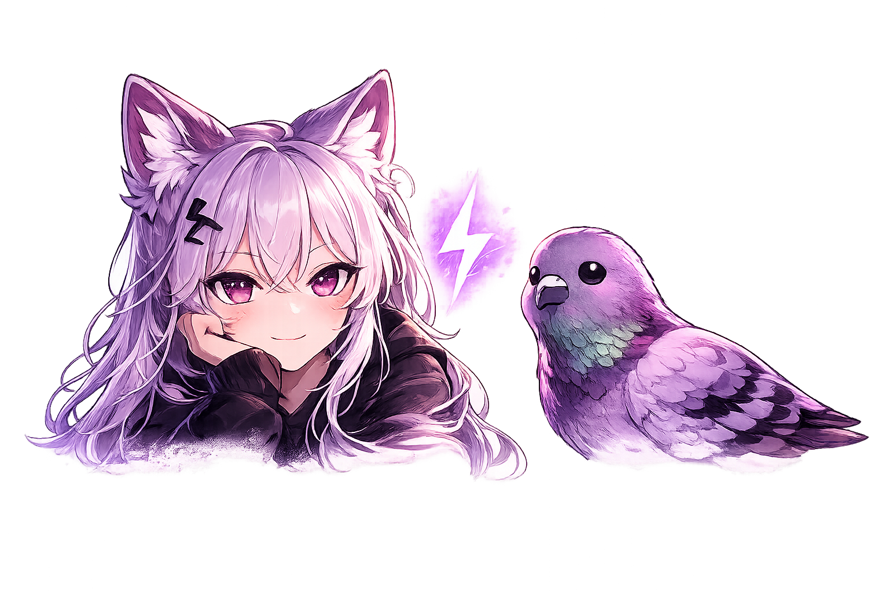
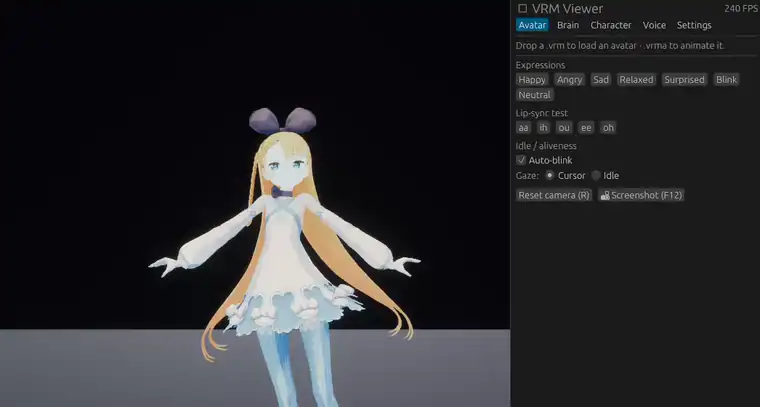

<div align="center">



# Ferra-VRM

**A native-Rust AI VTuber companion — bring your own model, own your waifu.**

Load a VRM avatar, point it at *your own* LLM and voice, and chat with a character that talks
back and lip-syncs — running natively on your machine. No browser, no cloud lock-in.

[](#license)
[](https://bevyengine.org)
[](https://www.twitch.tv/veracoded)
[](https://ko-fi.com/veracoded)



</div>

## What is this?

Ferra-VRM is a desktop AI companion: a [VRM](https://vrm.dev/en/) avatar with idle aliveness
(auto-blink), driven by **any LLM you point it at** and given a **voice by any TTS you point
it at**. Give it a personality with a character card, and it greets you, chats, and lip-syncs to
its own voice.

It's also a deliberate showcase of how light a **native-Rust** embodiment layer can be next to the
browser/Electron stacks this scene usually runs on — full avatar at hundreds of FPS in well under a
gigabyte of VRAM.

> **You bring the keys and the models. You own the companion.** Nothing is hardcoded, no
> telemetry — every request goes only to the endpoints you set.

## Quickstart

**Prebuilt binary** — grab the latest for your OS from
[Releases](https://github.com/PNGeon/Ferra-VRM/releases), unzip, and run.

**From source:**

```sh
git clone https://github.com/PNGeon/Ferra-VRM
cd Ferra-VRM
cargo run --release
```

Orbit-drag to rotate · scroll to zoom · **R** resets the camera · **F12** screenshots. The right
panel has tabs: **Avatar · Brain · Character · Voice · Settings**. Drop a `.vrm` on the window to
load an avatar, a `.vrma` to animate it, a `.toml` to load a character card.

## Features

- 🎭 **VRM 1.0 *and* 0.0 avatars** with automatic spring-bone physics + **VRMA** animation playback (legacy 0.0 models are converted on load)
- 🫧 **Idle aliveness** — natural auto-blink so a loaded avatar reads as alive
- 🧠 **Bring your own LLM** — any OpenAI-compatible endpoint, with built-in connection test + model picker
- 🎴 **Character cards** — name / persona / style / scenario / greeting → system prompt; share as `.toml`
- 🔊 **Bring your own voice** — OpenAI-compatible `/audio/speech` *or* a raw-PCM streaming server; the mouth lip-syncs to the actual voice
- 👂 **Ears — speech-to-text** — push-to-talk (hold **F2**), pure-Rust Whisper (candle); speak and she hears you, replies, and talks back — the full voice loop
- 📸 Orbit camera (HDR + bloom), screenshots, drag-and-drop, settings that persist

## Bring your own LLM

Brain tab → pick a provider preset (or type a Base URL) → **Test connection** fills the model list.
Local servers need no key; for cloud, paste yours.

| Backend | Base URL (example) | Key |
|---|---|---|
| llama.cpp server | `http://localhost:8080/v1` | – |
| Ollama | `http://localhost:11434/v1` | – |
| LM Studio | `http://localhost:1234/v1` | – |
| vLLM | `http://localhost:8000/v1` | – |
| OpenAI | `https://api.openai.com/v1` | required |
| OpenRouter | `https://openrouter.ai/api/v1` | required |

Reasoning models that stream a separate "thinking" channel are handled — only the final answer is
shown and spoken.

## Bring your own voice

Voice tab → **Speak replies aloud**, choose a provider:

- **OpenAI `/audio/speech`** — Base URL + `model` (e.g. `tts-1`) + `voice` + key; requests `response_format: pcm`.
- **raw-PCM stream** — `POST {base}/v1/tts/stream` `{text, voice}` returning raw **PCM s16le, mono, 24 kHz**.

A finished reply is spoken sentence-by-sentence and the avatar's mouth tracks the voice amplitude.

## Speak to her (speech-to-text)

Enable **Listen for speech** in the Voice tab, then **hold F2 and talk** — release to send. The
audio is transcribed locally by a **pure-Rust Whisper** (HuggingFace `candle`); the model
(`distil-whisper/distil-small.en` by default) downloads once on first use and is cached. Combined
with TTS, this closes the loop: **speak → she hears you → replies → talks back.** Nothing leaves
your machine.

## Character cards

Edit the Character tab and **Export** to a `.toml`, or **drop a `.toml`** onto the window to load
one:

```toml
name = "Aria"
persona = "A cheerful, curious AI companion who loves chatting and helping out."
speaking_style = "Warm, concise, and playful. Keep replies short."
scenario = "Hanging out with you at your desk."
greeting = "Hey! I'm Aria — what are we working on today?"
examples = ""
```

## Why native Rust?

The whole avatar + render pipeline is [Bevy](https://bevyengine.org) + native wgpu — no webview, no
Electron. On a modern discrete GPU the avatar renders at **hundreds of FPS in a fraction of a
gigabyte of VRAM**. The architecture is a small, readable workspace: a shared `vrm_stage_core`
library (VRM/VRMA, spring bones, expressions, idle aliveness, lipsync) and a thin `ferra-vrm` binary
on top. See [ARCHITECTURE.md](ARCHITECTURE.md).

## Platforms

Prebuilt binaries are published for **Windows (x64)**, **macOS (Apple Silicon + Intel)**, and
**Linux (x64)**. The whole stack (Bevy/wgpu, audio, networking) is cross-platform.

- **macOS**: the binaries are unsigned, so Gatekeeper will warn on first launch — right-click the
  app → **Open** (once), or `xattr -dr com.apple.quarantine ferra-vrm`.
- **Linux**: needs ALSA + udev at runtime (`libasound2`, `libudev`) — present on most desktops; on
  a minimal install: `sudo apt-get install libasound2 libudev1`.
- **GPU**: any GPU with Vulkan (Linux/Windows), Metal (macOS), or DX12 (Windows).

## Bring your own avatar

Ferra-VRM works with **VRM 1.0 and VRM 0.0** models — export one from
[VRoid Studio](https://vroid.com/en/studio) or grab a free one from
[VRoid Hub](https://hub.vroid.com/en) or Booth. Just drop the `.vrm` on the window. Legacy VRM 0.0
models (Unity-era, left-handed) are migrated and un-mirrored automatically on load.

## Contributing

PRs welcome — see [CONTRIBUTING.md](CONTRIBUTING.md). New LLM/TTS providers, animations, and
platform fixes are especially appreciated.

## License

Dual-licensed under either of [Apache-2.0](LICENSE-APACHE) or [MIT](LICENSE-MIT) at your option.

## Acknowledgements

Built on [Bevy](https://bevyengine.org) and [`bevy_vrm1`](https://github.com/not-elm/bevy_vrm1).
A respectful nod to kindred AI-VTuber projects like [AIRI](https://github.com/moeru-ai/airi) and
[Amica](https://github.com/semperai/amica).

---

<div align="center">

Made by **[veraCoded](https://www.twitch.tv/veracoded)** · dev [@PNGeon](https://github.com/PNGeon) 🦊🐦

If Ferra-VRM makes you smile, [**support on Ko-fi 💜**](https://ko-fi.com/veracoded)

</div>
